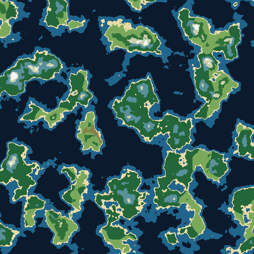

# Procedural Biome Generator

A procedural biome map generator that shows its work. Every map is built from
seeded simplex noise and resolves on screen in three narrated stages —
**elevation, then moisture, then biomes** — so you watch the algorithm assemble
the world before you start steering it. Drag the sliders mid-animation and it
cancels instantly into direct manipulation.

Maps are deterministic: same seed and settings, byte-identical map. The full
control state lives in the URL hash, so a shared link opens the exact same
world on any device.



> The image above is an evidence-frame export from performance testing, not a
> styled product shot. **TODO(owner): replace with a real screenshot of the
> deployed app** (drop a PNG at `docs/screenshot.png` after first deploy and
> update this path).

## Quick start

Requires Node 20.19+ or 22.12+ (Vite 8 requirement); developed and certified
on Node 24.

```bash
npm install
npm run dev        # dev server at http://localhost:5173/biome-generator/
npm test           # vitest, 213 tests across 16 suites
npm run build      # tsc --noEmit + vite build → dist/
npm run preview    # serve the production build locally
```

There are no runtime dependencies — TypeScript, Vite, Vitest and happy-dom are
all dev-time. The shipped bundle is plain DOM, Canvas and a Web Worker.

## What's in the box

- 12 biomes (Deep Ocean → Snow) classified by an elevation-first table with
  moisture bands, tuned so a luminance-separation rule keeps adjacent colors
  distinguishable including for deuteranopia.
- Three terrain presets — Archipelago, Continent, Highlands — that reshape the
  field parameters, not just the sliders.
- Seed input with a dice randomizer, PNG export, and share-via-URL.
- A staged first-load animation (~2.8s, skippable) with `aria-live` stage
  announcements and a `prefers-reduced-motion` bypass.

## Architecture

```
src/
├── noise/        # hand-ported Gustavson 2D simplex + fBm + seeded PRNG (pure)
├── generation/   # field pipeline (fBm → shaping → falloff → normalization),
│                 #   12-biome classifier + palette metadata
├── worker/       # the map worker: generate/recompute protocol, client,
│                 #   transferable buffers, detach guards
├── render/       # palette-LUT pixel composition, offscreen stage frames,
│                 #   crossfade animation controller
├── controller/   # update semantics: which input needs which recompute
├── ui/           # control panel wiring + a11y behavior
├── state/        # URL-hash serialization (versioned, sanitized)
└── presets/      # the three terrain presets
```

Control semantics are split by cost: moisture changes reclassify locally on
the main thread (no worker round-trip); elevation changes debounce into a
worker recompute — 256² preview resolution while dragging, 512² commit on
release; seed, dice and preset changes trigger the full animated regeneration.

## Engineering notes

- **Hand-written noise, golden-tested.** The simplex implementation is a
  direct port of Gustavson's 2005 public-domain paper (512-entry seeded
  permutation table, F2/G2 constants, radial falloff), pinned by golden-value
  tests at 1e-10 tolerance plus statistical checks. fBm runs 5 octaves,
  lacunarity 2.0, gain 0.5, with per-octave seed offsets.
- **All noise math is off the main thread.** The worker is bundled as a
  classic IIFE for maximum browser compatibility, and returns fields as
  zero-copy transferable `Float32Array`s with detach guards proving the
  buffers are never touched after posting. Rapid requests supersede
  (latest-wins); a crashed worker surfaces a typed error and the retry path
  terminates and recreates it.
- **Jank-free rendering by construction.** Classification goes through a
  64×64 elevation×moisture lookup table (4096 pre-classified cells), each
  animation stage is composed once into an offscreen canvas, and crossfades
  are GPU-composited `drawImage` calls — no per-frame pixel loops. Performance
  runs measured zero main-thread long tasks during drag and animation on
  Chromium and WebKit; a full 512² generation measured in-browser medians of
  ~99–129ms across those engines (throttled runs included), well inside the
  300ms budget (evidence in `docs/ultron/evidence/t16/`; a raw-Node
  re-measurement recorded ~78ms — see the T16 entry in
  `docs/ultron/production-log.md`).
- **Percentile range-normalization.** Raw shaped elevation gets its [2nd,
  99.999th] percentile span remapped to [0, 1], which is what keeps all 12
  biomes — including mountain and snow — reachable at every seed instead of
  only in theory.
- **Determinism as a test oracle.** Same inputs produce byte-identical
  arrays, enforced by digest tests over seeds × parameter sets × resolutions
  (the same mechanism caught a one-octave regression during mutation
  testing).

## Deployment

Static site on GitHub Pages via GitHub Actions (`.github/workflows/deploy.yml`):
push to `main` runs install → test → build → deploy. The Vite base path is
fixed to `/biome-generator/`, so the repo (and the live URL) must carry that
name. Operator steps for the one-time setup live in
`docs/ultron/t18-deploy-runbook.md`.

## Project provenance

Built as a planned, logged project: every task has an evidence trail in
`docs/ultron/` (plan, production log, research decisions, test evidence).
